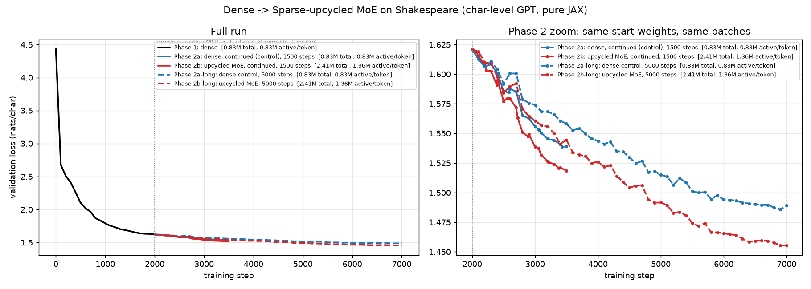

# Dense → MoE upcycling, from scratch

Train a small dense char-level GPT on Shakespeare, convert its MLPs into a top-2-of-4 Mixture of
Experts *without changing what it computes*, and keep training. Pure JAX, no frameworks.



| | val loss @2000 | @3500 (1500-step run) | @7000 (5000-step run) | params (total / active) |
|---|---|---|---|---|
| dense, continued (control) | 1.6210 | 1.5390 | 1.4890 | 0.83M / 0.83M |
| upcycled MoE, continued | 1.6210 | **1.5186** | **1.4554** | 2.41M / 1.36M |

The MoE lead grows from 0.020 nats/char at 1500 steps to 0.034 at 5000 steps, with no sign of saturating
(dashed curves in the plot; `run_long.sh`). Both arms start from the same checkpoint and see identical batches.

E/k sweep (`run_sweep.sh`, `python sweep_report.py`, `runs/sweep.png`): every upcycled variant beats the
dense control at 1500 steps; E=8 top-2 is best (1.5117). Caveat: with top-1 the renormalised gate is
constant, so the router never learns and those arms are effectively fixed random routing — see `CLAUDE.md`.

Router ablations on E=8 top-2 (`run_ablation.sh`, `python router_analysis.py runs/moe_e8_k2*`): no balancing loss
collapses each layer to two live experts; a zero-init router leaves the experts as bit-identical pairs (no better than
dense); a stronger balancing loss (0.1) or a larger router init (1e-2) each beat the baseline, and together give the
best run of the project: **1.4976** at step 3500 (E=8, top-2, 4.52M total / 1.36M active) vs 1.5390 dense.
Over 3 paired seeds the gap is **−0.040 ± 0.0015** nats/char (`run_seeds.sh`, `seeds_report.py`).

Aux-loss-free balancing (DeepSeek-V3-style selection bias, `--bias-gamma`, `run_bias*.sh`): matches the auxiliary loss
(1.501–1.502 vs 1.4976–1.5007) once the bias acts on bounded scores or with a large enough step; on raw logits at the
paper's step size it loses a race against router confidence and collapse persists.

Full narrative of the findings, including the negative results: [`RESULTS.md`](RESULTS.md).

## The idea in three lines

1. A dense transformer block's MLP is `y = W2·gelu(W1·x)`.
2. An MoE block has E such MLPs ("experts") and a tiny router `softmax(x·Wr)`; each token uses only the top-k experts, weighted by the router.
3. **Upcycling**: set every expert to a copy of the trained dense MLP and the router near-uniform. Since the top-k gates are renormalised to sum to 1 and all experts agree, the output is *identical* to the dense model — so you start from the dense model's loss, not from scratch. Training then breaks the symmetry and experts specialise (`verify.py` shows expert weights drift 12–24% apart).

## Run it

```bash
pip install jax jaxlib numpy matplotlib
bash run_experiment.sh        # resumable; Ctrl-C and rerun any time
python verify.py              # 3 sanity checks
```

See `CLAUDE.md` for design decisions, config, and the queue of follow-up experiments.
