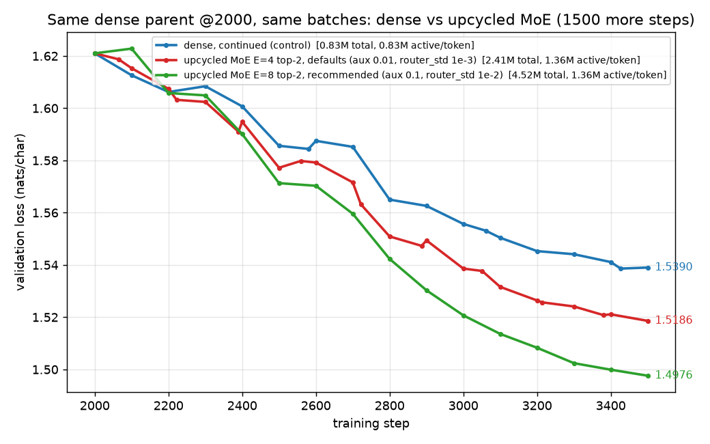

# Dense → sparse-upcycled MoE: what we found

Narrative summary of the experiment, in the order the story is best told. All numbers are validation loss in
nats/char on the last 5% of a 5.06M-char Shakespeare corpus (char-level GPT, 4 layers, d_model 128, pure JAX).
Every MoE run starts from the same dense checkpoint at step 2000 (val 1.6210) and, unless stated, trains 1500
more steps with the same LR schedule and the same batch order as the dense control. Raw logs: `runs/*/log.csv`.
Reproduce: `run_experiment.sh`, `run_long.sh`, `run_sweep.sh`, `run_ablation.sh`, `run_seeds.sh`; check: `verify.py`.

## 1. Upcycling is exactly function-preserving

Copy the trained dense MLP into every expert, add a near-zero router, renormalise the top-k gates to sum to 1.
Because all experts agree, the output does not depend on which ones the router picks, so the MoE *is* the dense
model at conversion time: max |logit difference| = 2–3e-5 (float noise), and all 17 upcycled runs in `runs/` log
exactly the parent's 1.6210 at step 0 (`verify.py` checks [1] and [4]). This holds for E=2…8, k=1,2, and any
router init scale — the renormalisation cancels the router at conversion.

## 2. The upcycled MoE learns faster than the dense model, and the lead keeps growing

| arm | steps | params total / active | val end |
|---|---|---|---|
| dense, continued (control) | 2000→3500 | 0.83M / 0.83M | 1.5390 |
| upcycled MoE E=4 top-2 | 2000→3500 | 2.41M / 1.36M | 1.5186 (−0.020) |
| dense, continued (control) | 2000→7000 | 0.83M / 0.83M | 1.4890 |
| upcycled MoE E=4 top-2 | 2000→7000 | 2.41M / 1.36M | 1.4554 (−0.034) |

The gap widens roughly linearly (−0.013 @3000, −0.023 @5000, −0.034 @7000) with no sign of saturating.
Experts do specialise: pairwise relative distance between expert weights goes from 0.00 at conversion to
0.12–0.24, more in later layers (`verify.py` check [2]).

Caveat on cost: the toy computes all E experts for every token and masks the unselected ones ("dense-masked"),
so wall-clock is ~E× a dense step. That is an implementation choice, not an MoE property; real dispatch is
follow-up work (#5 in `CLAUDE.md`).

## 3. Sweep over E and k: every variant beats dense; top-2 ≫ top-1; more experts helps at top-2

| E | k | active params | val @3500 | vs dense |
|---|---|---|---|---|
| 2 | 1 | 0.83M | 1.5353 | −0.004 |
| 4 | 1 | 0.83M | 1.5286 | −0.010 |
| 8 | 1 | 0.83M | 1.5330 | −0.006 |
| 2 | 2 | 1.36M | 1.5306 | −0.008 |
| 4 | 2 | 1.36M | 1.5186 | −0.020 |
| 8 | 2 | 1.36M | 1.5117 | −0.027 |

(`runs/sweep.png`). E=2 top-2 is not sparse — both experts always fire — so it is a gated 2×-wide MLP and a
useful "just widen the MLP" reference.

## 4. Surprise: with renormalised gates, a top-1 router never learns

With k=1 the renormalised gate is p/p ≡ 1, so its derivative w.r.t. the router is exactly zero: the router
receives no language-model gradient at all, only the load-balancing loss, which drives it to uniform. Evidence:
every top-1 arm ends with a perfectly uniform load and aux loss exactly 1.000, and its router weights barely move
from init (RMS 1.1–1.7e-3 vs 1e-3), while top-2 routers grow ~10×. So the top-1 numbers above are *fixed
pseudo-random routing* — still slightly better than dense (as hash-routing papers report), but not learned routing.

## 5. The obvious fix makes it worse

Dividing by `stop_gradient(sum)` keeps the forward pass identical (still function-preserving) but lets the
router learn with k=1. The learning is harmful: the gradient becomes "raise confidence in whichever expert was
picked if its output currently helps", which at the symmetric upcycle point carries no information about *which*
expert is better. Result: rich-get-richer collapse (one expert takes 71–75% of a layer), aux loss climbs to
1.2–1.4, and every stop-gradient arm is worse than its twin — top-1 arms end *worse than dense*
(E=4: 1.5491 vs 1.5390). Kept as an ablation (`--gate-grad stopgrad`), default unchanged. `tests/test_gating.py`
pins both behaviours.

## 6. Router ablations on E=8 top-2: balance and symmetry breaking are both necessary, and additive

| aux_coef | router_std | val @3500 | what happened |
|---|---|---|---|
| 0 | 1e-3 | 1.5251 | collapse: 3 of 4 layers use exactly 2 experts (top-2 → dense again); 20/32 expert slots dead |
| 0.01 | 1e-3 | 1.5117 | baseline; one expert at ~50% in layers 0–1, 2 dead |
| 0.1 | 1e-3 | 1.5037 | perfectly balanced (max load 0.15 ≈ 1/8) |
| 0.01 | 0 | 1.5369 | experts stay **bit-identical in pairs** (0,1),(2,3),(4,5),(6,7) forever → ≈ dense |
| 0.01 | 1e-2 | 1.5007 | larger init noise → faster specialisation |
| **0.1** | **1e-2** | **1.4976** | **best run; balanced; gap to dense −0.041, 2× the E=4 default** |

Why the pairs with zero init: exact ties make `top_k` pick the same two experts for every token; the aux loss
rotates *which* pair, but a pair is always selected together with gates 0.5/0.5, so both members get identical
gradients forever. The aux loss cannot break symmetry; the router init must.
At E=4 the balancing strength barely matters (1.5186 vs 1.5176) — the sensitivity scales with E.

Recommended settings for follow-ups: E=8, top-2, aux_coef 0.1, router_std 1e-2 (`router_analysis.py` for diagnostics).

## 7. Error bars (paired seeds)

Three paired seeds of dense control vs the recommended MoE (within a pair both arms see identical batches;
the MoE router init also varies with the seed). `run_seeds.sh`, `python seeds_report.py`.

| data-seed | dense control | MoE E=8 recommended | MoE − dense |
|---|---|---|---|
| 1234 (orig) | 1.5390 | 1.4976 | −0.0414 |
| 1 | 1.5385 | 1.5001 | −0.0384 |
| 2 | 1.5409 | 1.5008 | −0.0401 |
| **mean ± sd (n=3)** | 1.5395 ± 0.0013 | 1.4995 ± 0.0017 | **−0.0400 ± 0.0015** |

Seed-to-seed spread is ~0.0015 nats/char. That makes the headline gap (−0.040) and the E=8-recommended vs
E=4-default difference (~−0.02) unambiguous, and the long-run widening (−0.020 → −0.034) real. Differences
between the top ablation arms (0.003–0.006: combined vs std-only vs aux-only) are only 2–4 sd and should be
read as "same ballpark, combined is at least as good", not as a ranking. Single-seed numbers elsewhere in this
document carry the same ±0.0015 uncertainty.

## Not done / open

- Real sparse dispatch and a fair wall-clock comparison (#5). Fair-FLOPs dense control with d_ff=1024 (#6).
- Expert specialisation by character class / speaker lines (#4). Upcycle-vs-from-scratch at equal compute (#7).
- A top-1 gate that is both function-preserving and informative (#2c) — only if the equal-active-params story matters.
